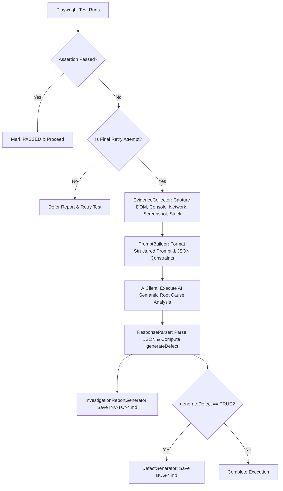

# 🛡️ QA AI Defect Sentinel (`qa-ai-defect-sentinel`)

An autonomous, AI-driven **Playwright Test Failure Investigation Engine** and end-to-end automation framework built in JavaScript.

[](https://playwright.dev/)
[](https://nodejs.org/)
[](https://openai.com/)
[](#license)

---

## 📌 Project Summary

**QA AI Defect Sentinel** (`qa-ai-defect-sentinel`) is designed to solve a major pain point in test automation: **manual triage of test failures**.

When a Playwright test fails, the Sentinel passively activates on the final retry attempt to capture runtime evidence (DOM snapshots, stack traces, console error logs, network failures, screenshots), analyze the root cause using AI semantic reasoning, and automatically generate comprehensive **Markdown Investigation Reports** and formal **Defect Reports**.

It tests **BuggyShop**, a single-page web application built with intentional e-commerce bugs (out-of-stock additions, total calculation errors, case-sensitive search bugs) to demonstrate real-world failure analysis.

---

## ⚡ Key Features

- **🤖 Zero-Overhead Monitoring**: Listens silently to network traffic and console errors during test runs; activates AI analysis **only** after assertion failure on the final retry.
- **🧠 Semantic AI Root Cause Analysis**: Evaluates expected vs. actual outcomes, stack frames, network failures, and DOM states across 17 standardized categories without fragile keyword rules.
- **📄 Automated Markdown Reports**:
  - `defects/investigations/INV-TC*-*.md`: In-depth investigation report with customer impact, business risk, developer recommendations, and release risk.
  - `defects/BUG-*.md`: Formal defect tickets created automatically when a product bug is confirmed with confidence ≥ 85%.
- **🎯 Page Object Model (POM) Architecture**: Modular, maintainable test scripts separated by domain objects (`HomePage`, `CartComponent`, `SearchComponent`).
- **🔌 Dual AI Provider System**: Seamlessly integrates with OpenAI (`gpt-4o`) when an API key is present, with automatic fallback to an internal semantic analyzer for offline/local execution.

---

## 🔄 How the Sentinel Works



---

## 📁 The `ai/` Sentinel Engine (File-by-File Purpose)

The `ai/` folder houses the complete core engine of **QA AI Defect Sentinel**:

```
ai/
├── evidenceCollector.js
├── promptBuilder.js
├── aiClient.js
├── responseParser.js
├── investigationReportGenerator.js
├── defectGenerator.js
└── index.js
```

| File Path | Purpose & Function |
|---|---|
| 📄 [ai/evidenceCollector.js](file:///c:/Users/SubhadeepMaji/Downloads/BuggyShop_QA_Practice/ai/evidenceCollector.js) | Listens to browser console logs and network failures during execution. On test failure, captures DOM snapshot, stack trace, screenshot, URL, browser/OS metadata, execution time, and requirement IDs (`TC002`). |
| 📄 [ai/promptBuilder.js](file:///c:/Users/SubhadeepMaji/Downloads/BuggyShop_QA_Practice/ai/promptBuilder.js) | Synthesizes normalized evidence into system and user prompts for the AI LLM model, enforcing 17 standardized categories and strict JSON output schema formatting. |
| 📄 [ai/aiClient.js](file:///c:/Users/SubhadeepMaji/Downloads/BuggyShop_QA_Practice/ai/aiClient.js) | Orchestrates AI analysis execution using the OpenAI API (`gpt-4o`) or an internal semantic reasoning engine for offline runs without keyword `if/else` matching. |
| 📄 [ai/responseParser.js](file:///c:/Users/SubhadeepMaji/Downloads/BuggyShop_QA_Practice/ai/responseParser.js) | Cleans markdown code fences, validates JSON structure, and calculates `generateDefect = (isProductBug && confidence >= threshold)`. |
| 📄 [ai/investigationReportGenerator.js](file:///c:/Users/SubhadeepMaji/Downloads/BuggyShop_QA_Practice/ai/investigationReportGenerator.js) | Consumes structured AI JSON output to generate standard Markdown Investigation Reports (`defects/investigations/INV-TC*-*.md`). |
| 📄 [ai/defectGenerator.js](file:///c:/Users/SubhadeepMaji/Downloads/BuggyShop_QA_Practice/ai/defectGenerator.js) | Consumes structured AI JSON output to create formal Markdown Defect Reports (`defects/BUG-*.md`) when a product bug is confirmed. |
| 📄 [ai/index.js](file:///c:/Users/SubhadeepMaji/Downloads/BuggyShop_QA_Practice/ai/index.js) | ES Module barrel export file providing clean imports across the framework. |

---

## 📂 Project Repository Structure

```
qa-ai-defect-sentinel/
├── ai/                          # QA AI Defect Sentinel Core Engine
│   ├── aiClient.js
│   ├── defectGenerator.js
│   ├── evidenceCollector.js
│   ├── index.js
│   ├── investigationReportGenerator.js
│   ├── promptBuilder.js
│   └── responseParser.js
├── application/                 # Web Application Under Test (BuggyShop)
│   ├── index.html
│   └── app.js                   # Web app JS with intentional bugs
├── defects/                     # Output AI defect & investigation reports
│   └── investigations/
├── docs/                        # Specifications & Architecture docs
│   ├── AI_INVESTIGATION_SPEC.md
│   └── AI_INVESTIGATION_ARCHITECTURE.md
├── fixtures/                    # Playwright custom fixtures & auto-failure hook
│   └── index.js
├── logs/                        # Winston log outputs (combined.log, error.log)
├── pages/                       # Page Object Model classes
│   ├── BasePage.js
│   ├── HomePage.js
│   ├── CartComponent.js
│   └── SearchComponent.js
├── reports/                     # Playwright HTML, JSON, JUnit execution reports
├── screenshots/                 # Captured full-page failure screenshots
├── tests/                       # Playwright test specs
│   ├── accessibility.spec.js
│   ├── boundary.spec.js
│   ├── crossbrowser.spec.js
│   ├── functional.spec.js
│   ├── negative.spec.js
│   ├── performance.spec.js
│   ├── regression.spec.js
│   ├── sanity.spec.js
│   ├── security.spec.js
│   ├── smoke.spec.js
│   └── ui.spec.js
├── utils/                       # Loggers, execution report generators, failure handler
│   ├── evidenceCollector.js
│   ├── failureHandler.js
│   ├── logger.js
│   └── reportGenerator.js
├── .env.example                 # Template environment variables
├── package.json                 # Project manifest & test scripts
└── playwright.config.js         # Playwright test runner configuration
```

---

## 🚀 Quick Start

### 1. Installation
```bash
git clone https://github.com/Subhadeeep25/qa-ai-defect-sentinel.git
cd qa-ai-defect-sentinel
npm install
```

### 2. Configure Environment
Copy `.env.example` to `.env`:
```bash
cp .env.example .env
```
*(Optional: Add your `OPENAI_API_KEY` in `.env` to use OpenAI `gpt-4o`. If left blank, the Sentinel will automatically use its internal semantic engine).*

### 3. Run Automation Tests
```bash
# Run all Playwright tests
npx playwright test

# Run tests in headed browser mode
npm run test:headed

# Run smoke test suite
npm run test:smoke

# Run a specific test case (e.g. TC002)
npx playwright test -g "TC002"

# View Playwright HTML Report
npx playwright show-report reports/html-report
```

---

## 📄 Sample Generated Outputs

### Investigation Report Sample (`INV-TC002-*.md`)
```markdown
==================================================
INVESTIGATION REPORT
==================================================
Execution ID: EXEC-1784907275358
Test Case: TC002 - All 15 product cards render on page load
Environment: development | Browser: chromium

FAILURE SUMMARY:
Application functional output differed from expected business requirements. Received: 6

AI ROOT CAUSE ANALYSIS:
Category: Product Bug | Confidence: 92%
Reasoning: Assertion evaluation revealed a discrepancy between expected business logic output and actual UI state...

BUSINESS IMPACT:
Release Risk: NO-GO recommendation until defect is addressed.
RECOMMENDED FIX: Align application code filtering logic with specification.
```

---

## 📜 License
Distributed under the **MIT License**. See `LICENSE` for details.
